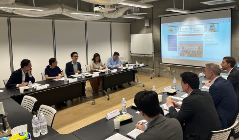
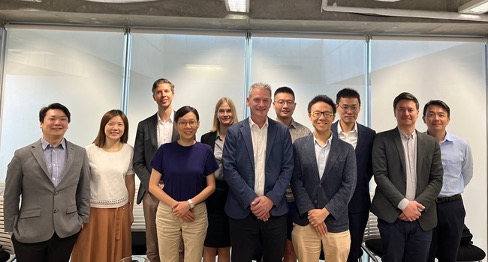

A panel meeting, entitled “Defense and Security in the Asia-Pacific” with a delegation from the Swedish Defence Research Agency (FOI) in the U.S.A., led by Deputy Research Director Oscar Almen of FOI’s Department of Security Policy, was held on October 15, 2024, in the Social Sciences Building of NTU. The panel was co-chaired by NTUCCS Director Chi-Ting Tsai, and invited scholars and experts from NTU, including Dr. George Yin, Deputy Director of the World and China Program at NTUCCS, Professor Mandy Hsiao-chuan Liao and Yi-hao Su at Department of Political Science, Professor Chelsea Chia-Chen Chou, and Dr. Nien-Chung Chang Liao at Institute of Political Science at Academia Sinica.

