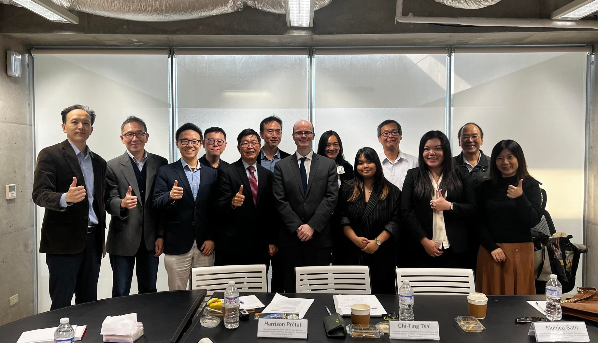

本中心於3月18日下午辦理DEEP BLUE SCARS: Environmental Threats to the South China Sea Workshop，由本中心蔡季廷執行長主持，邀請美國智庫戰略暨國際研究中心（CSIS）「亞洲海事透明倡議」(AMTI) Harrison Prétat (Deputy Director) 與 Monica Sato (Research Associate)就該主題進行演講，並邀請相關領域學者與會討論及進行交流，與會學者包含: 師範大學政治學研究所王冠雄教授、中央研究院歐美研究所宋燕輝研究員、中央警察大學公共安全學系陳偉華副教授、政治大學外交學系蔡沛倫助理教授、臺大漁業科學研究所柯佳吟副教授、臺大海洋中心劉家瑄執行長、臺大海洋研究所蘇志傑副教授、臺大政治學系唐欣偉副教授、臺大政治學系廖小娟副教授、臺大政治學系郭銘傑副教授。

