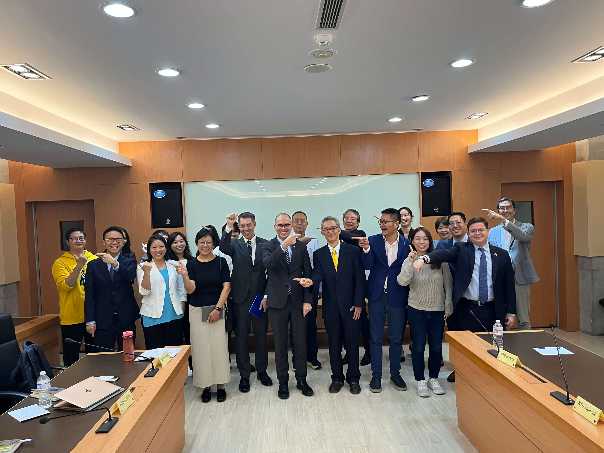
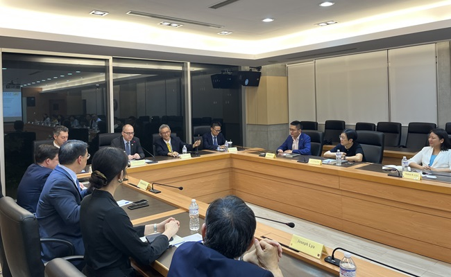
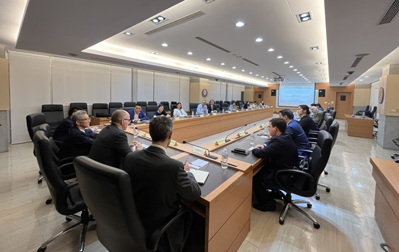

A panel meeting, entitled “Technology for the Future of National Security,” with a delegation from the RAND Corporation in the U.S.A., led by RAND’s President and CEO Jason Matheny, was held on October 23, 2024, in the Social Sciences Building of NTU. The panel was co-chaired by NTUCCS Executive Director S. Philip Hsu, and invited scholars from NTU such as NTUCCS Director Chi-Ting Tsai and Dr. George Yin, Deputy Director of the World and China Program, and experts from Taiwan’s TSMC Corporation and ASUS Corporation.

